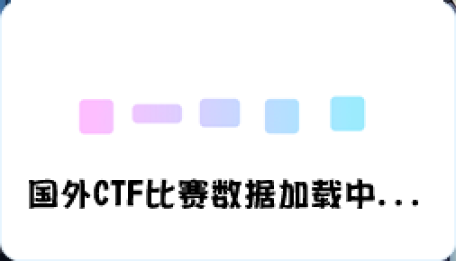
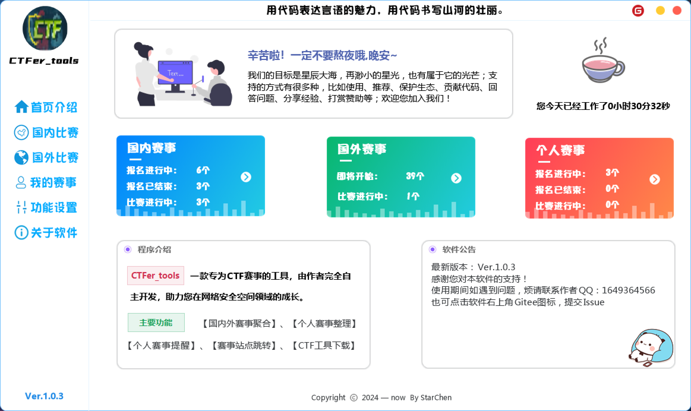
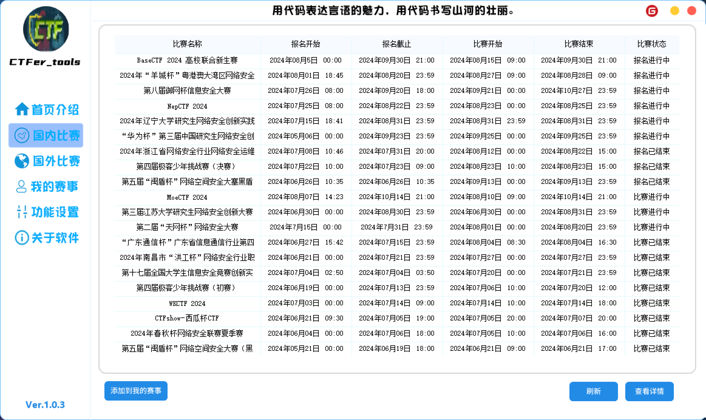
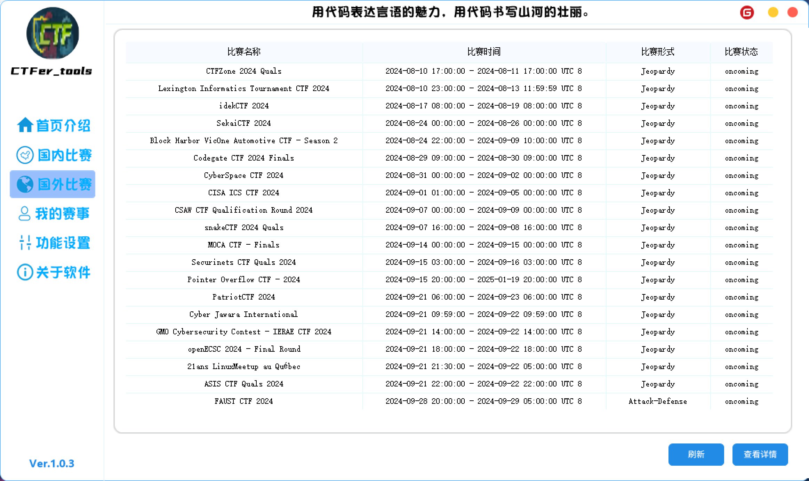
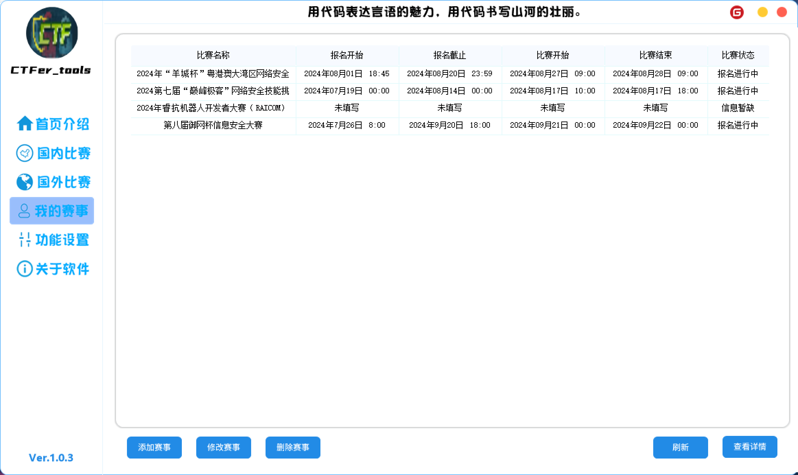
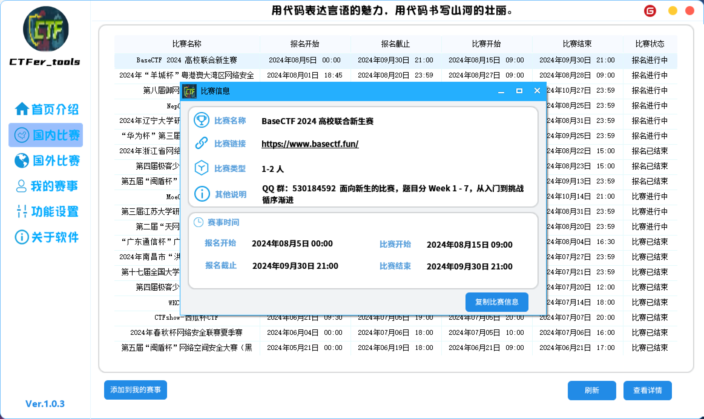
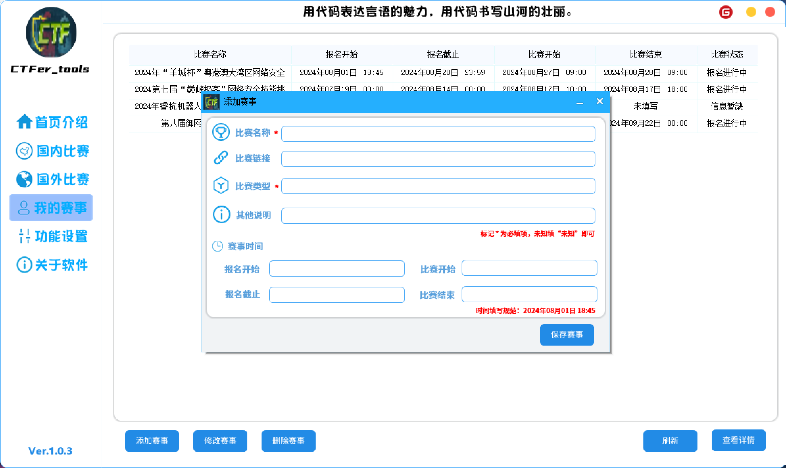

# CTFer_tools

#### 介绍
CTFer_tools：一款专为CTF赛事的工具，由作者完全自主开发，助力您在网络空间领域的成长。

#### 软件架构
易语言开发

#### 安装教程

点击update.exe可以直接进行更新和下载使用。

#### 特技

1.  【国内外赛事聚合】
2.  【个人赛事整理】
3.  可进行本地更新下载。
4.  记录工作时间。

#### 预计目标

1.  完成【个人赛事提醒】
2.  完成【赛事站点跳转】
3.  完成【CTF工具下载】

#### Tip

功能设置未完成，无功能显示为正常。

# 功能截图

## 加载界面

## 首页介绍

## 国内比赛

## 国外比赛

## 我的赛事

## 赛事详情

## 添加赛事

# 功能设置

# 关于软件

