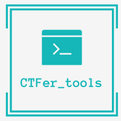
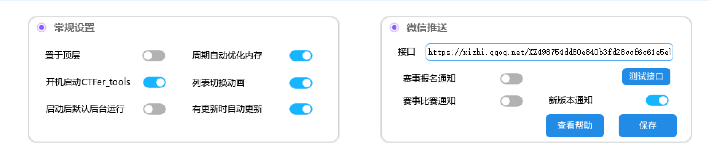

# CTFer_tools

## 软件简介

CTFer_tools：一款专为CTF赛事的工具，由作者完全自主开发，助力您在网络空间领域的成长。

- 【国内外赛事聚合】、【个人赛事整理】、【个人赛事提醒】
- 【赛事站点跳转】、【CTF工具下载】、【通知微信推送】
- 【更新推送】、【开机自启】、【内存优化】

## 软件架构

易语言开发

#### 安装教程

点击update.exe可以直接进行更新和下载使用。

#### 预计目标

1.  完成【个人赛事提醒】
2.  完成【赛事站点跳转】
3.  完成【CTF工具下载】

#### Tip

功能设置未完成，无功能显示为正常。

# 字体列表

- [思源黑体CN-Bold.otf](https://pan.00005.asia/down.php/c76f8a8f08293d0e1c5dc8302f7062aa.otf)
- [梦源黑体 CN W27.ttf](https://pan.00005.asia/down.php/76cdb72649b6d4ed424ae59397b57711.ttf)
- [梦源黑体 CN W20.ttf](https://pan.00005.asia/down.php/c20a2850b3b78f3e345256dabdee4dbc.ttf)
- [梦源黑体 CN W15.ttf](https://pan.00005.asia/down.php/4cf487f45cf89b87e590fc127c334d49.ttf)
- [YouSheBiaoTiHei-2.ttf](https://pan.00005.asia/down.php/1726685ca93be4e04930d6561afd1d68.ttf)
- [SourceHanSansSC-Medium-2.otf](https://pan.00005.asia/down.php/ebc3cd485fe89cc90b38be33464894ae.otf)
- [SourceHanSansSC-Light-2.otf](https://pan.00005.asia/down.php/4661a5fe64440dda204dde5a2605f9a6.otf)
- [fzkt.TTF](https://pan.00005.asia/down.php/d8d4f4cd37f444e0d4a32e7f8d429b1f.ttf)

# 功能截图

## 加载界面

## 首页介绍

## 国内比赛

## 国外比赛

## 我的赛事

## 赛事详情

## 添加赛事

# 功能设置

# 关于软件

