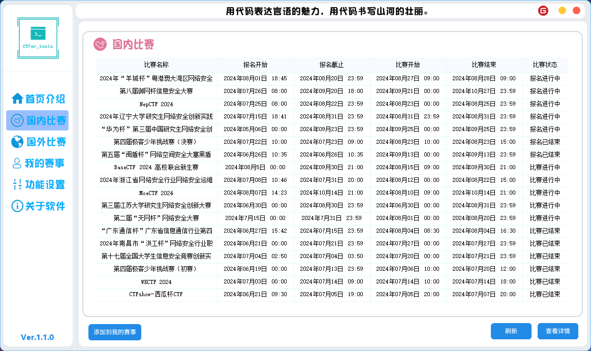
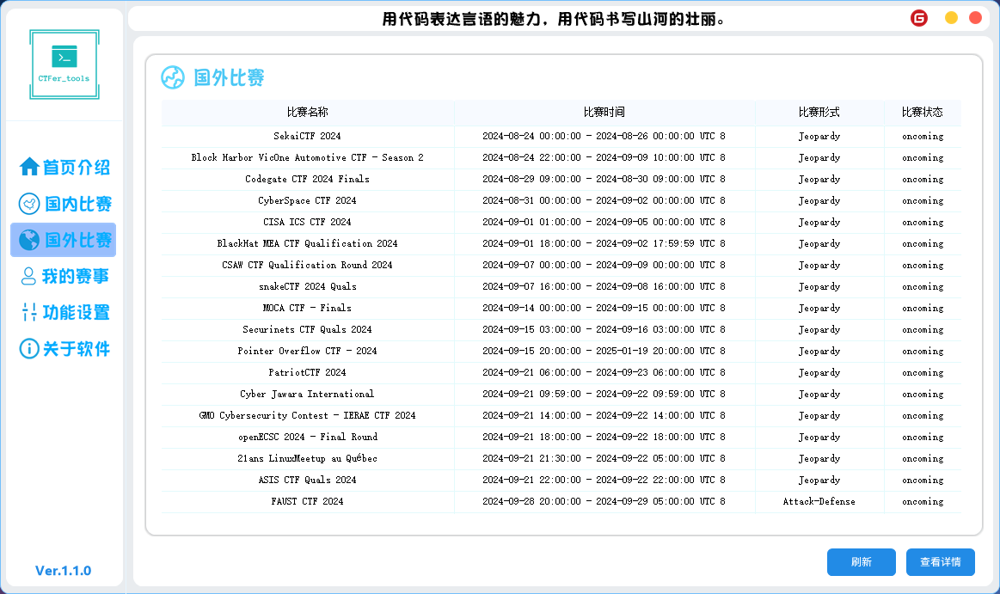
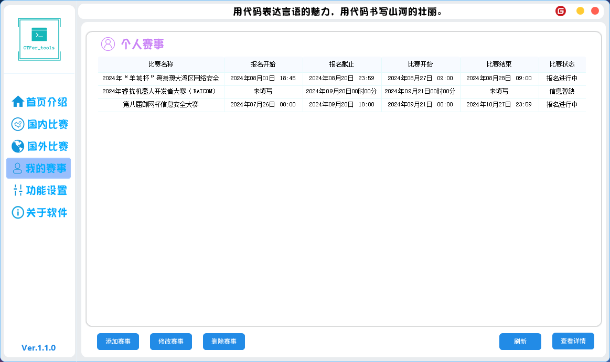
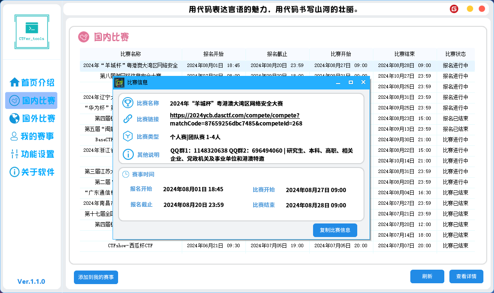
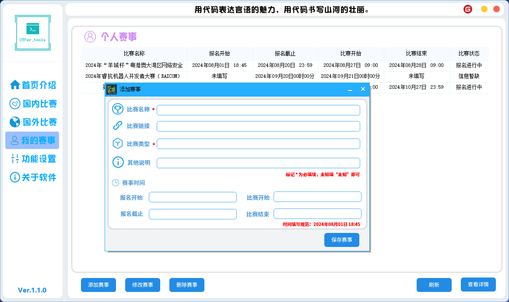
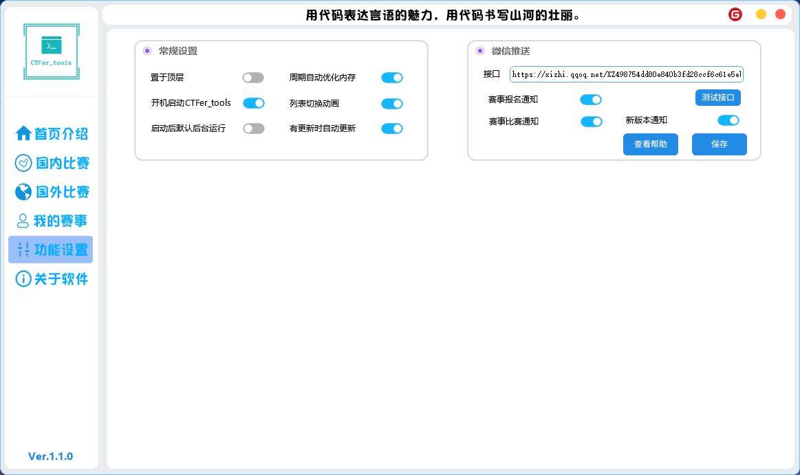

# CTFer_tools

## 软件简介

CTFer_tools：一款专为CTF赛事的工具，由作者完全自主开发，助力您在网络空间领域的成长。

- 【国内外赛事聚合】、【个人赛事整理】、【个人赛事提醒】
- 【赛事站点跳转】、【CTF工具下载】、【通知微信推送】
- 【更新推送】、【开机自启】、【内存优化】

## 软件架构

易语言开发

#### 安装教程

点击update.exe可以直接进行更新和下载使用。

#### 预计目标

1.  完成【赛事站点跳转】
2.  完成【CTF工具下载】

# 软件特点

1. 对UI进行多次优化更新，保证软件的顺畅和稳定。
2. 对更新器进行多次更改和完善，保证用户云端更新的信息及时性和稳定性。

# 功能截图

## 加载界面

## 首页介绍

## 国内比赛

## 国外比赛

## 我的赛事

## 赛事详情

## 添加赛事

## 功能设置

# 关于软件

# 更新日志

1.0.5 更新日志
【修复】：工作时长二次打开记录异常
【优化】：update.exe更新程序优化
【修复】：修复update更新器下载文件后软件无法使用
【修复】：个人赛事时间显示问题
【优化】：为减少占用内存和下载时长，全面删除fonts字体库
【新增】：新版本微信通知推送
【新增】：赛事报名微信通知推送
【新增】：赛事比赛微信通知推送
1.0.4 更新日志
【修复】：软件心跳算法
【修复】：进程销毁残留
【修复】：在线状态异常
【修复】：重复运行弹窗提示
【新增】：微信通知推送
【新增】：周期自动优化内存
【新增】：列表切换动画开关
【新增】：有更新时自动更新
【新增】：微信推送接口
【优化】：正式使用CTFer_tools官方logo
【新增】：软件关闭销毁动画
Tip：赛事通知暂不可用，下版本更新
1.0.3 更新日志
【新增】：置于顶层
【新增】：开机自动启动CTFer_tools
【新增】：启动后默认后台运行
【新增】：左下角版本显示，点击检测更新
【优化】：首页介绍UI设计
【修复】：【我的赛事】比赛状态获取异常
【修复】：【我的赛事】赛事时间填入异常
【新增】：【关于软件】作者引入
1.0.2 更新日志
【新增】：【我的赛事】增删改查
【优化】：【首页介绍】UI美化
【修复】：【国内赛事】【国外赛事】查询稳定性