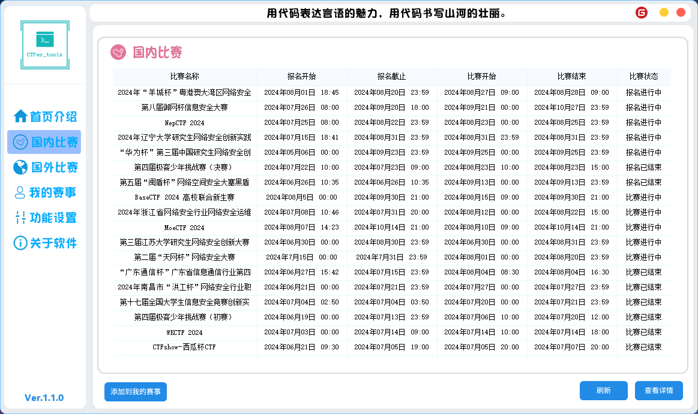
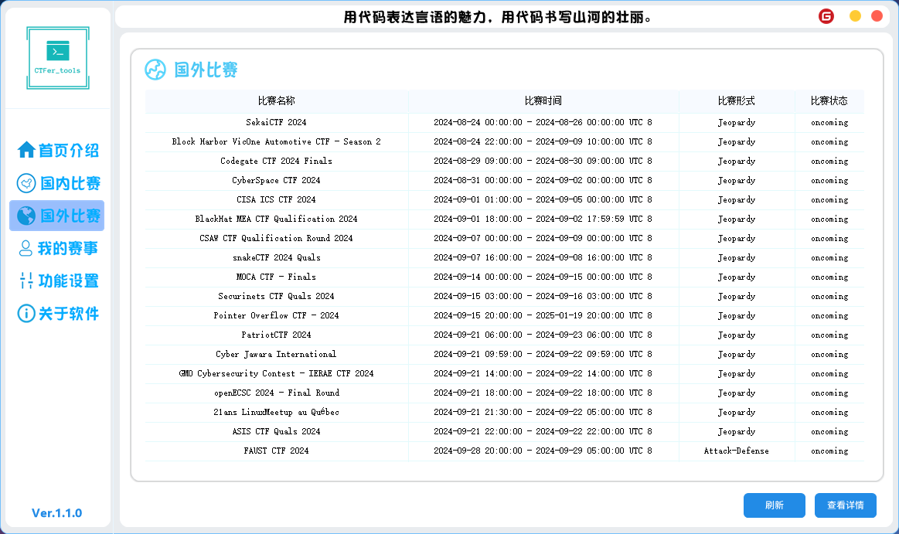
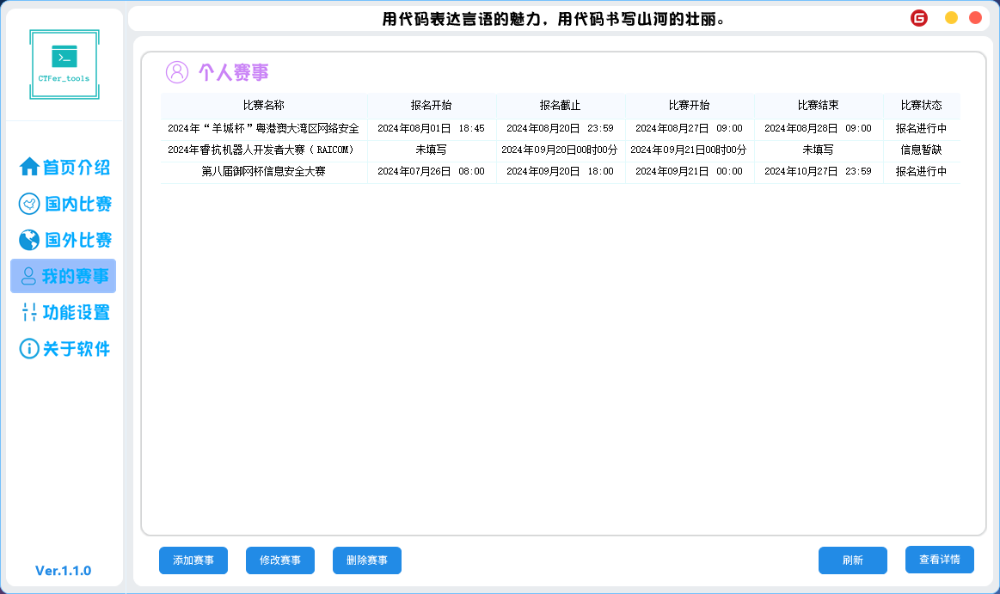
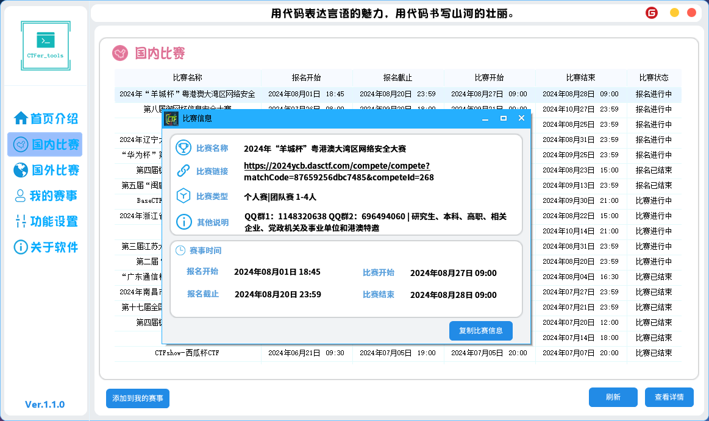
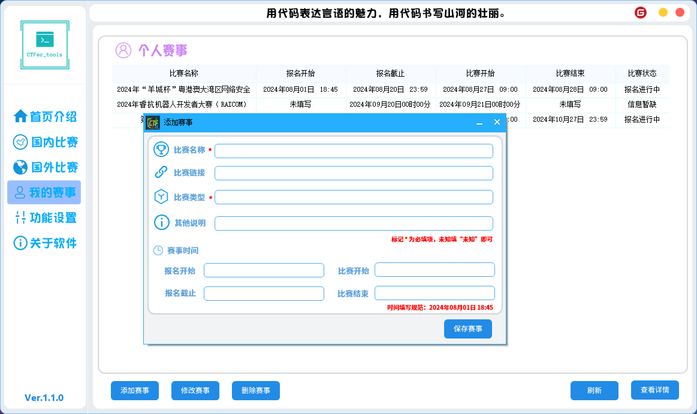
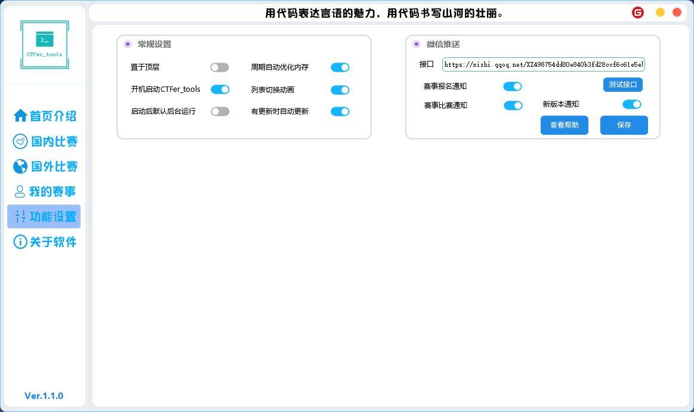

# CTFer_tools

## 软件简介

CTFer_tools：一款专为CTF赛事的工具，由作者完全自主开发，助力您在网络空间领域的成长。

- 【国内外赛事聚合】、【个人赛事整理】、【个人赛事提醒】
- 【赛事站点跳转】、【CTF工具下载】、【通知微信推送】
- 【更新推送】、【开机自启】、【内存优化】

## 软件架构

易语言开发

#### 安装教程

点击update.exe可以直接进行更新和下载使用。

#### 预计目标

1.  完成【赛事站点跳转】
2.  完成【CTF工具下载】

# 软件特点

1. 对UI进行多次优化更新，保证软件的顺畅和稳定。
2. 对更新器进行多次更改和完善，保证用户云端更新的信息及时性和稳定性。

# 功能截图

## 加载界面

## 首页介绍

## 国内比赛

## 国外比赛

## 我的赛事

## 赛事详情

## 添加赛事

## 功能设置

# 关于软件

